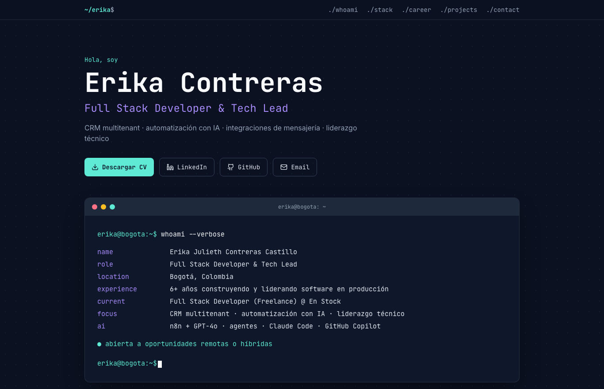

# Erika Contreras — CV interactivo

Sitio web personal con mi hoja de vida interactiva: experiencia, habilidades, proyectos, educación y contacto, en una sola página responsive.

🔗 **Demo:** [AGREGA AQUÍ EL ENLACE CUANDO LO PUBLIQUES]



## Secciones

- **Inicio:** presentación con animaciones y enlaces de contacto
- **Sobre mí:** perfil profesional
- **Experiencia:** trayectoria como Desarrolladora Full Stack y Líder Técnica
- **Habilidades:** stack de frontend, backend, datos, infraestructura y automatización con IA
- **Proyectos:** CRM multitenant, CRM de Element Insurance y otros productos
- **Educación y contacto**

## Tecnologías

- **React 18** + **TypeScript**
- **Vite** (build y servidor de desarrollo)
- **Tailwind CSS** (estilos y diseño responsive)
- **lucide-react** (íconos)
- **ESLint** (calidad de código)

## Cómo ejecutarlo

Requisitos: Node.js 18 o superior.

```bash
npm install
npm run dev        # servidor de desarrollo en http://localhost:5173
npm run build      # build de producción en /dist
npm run preview    # previsualizar el build
npm run lint       # revisar el código
npm run typecheck  # verificar tipos de TypeScript
